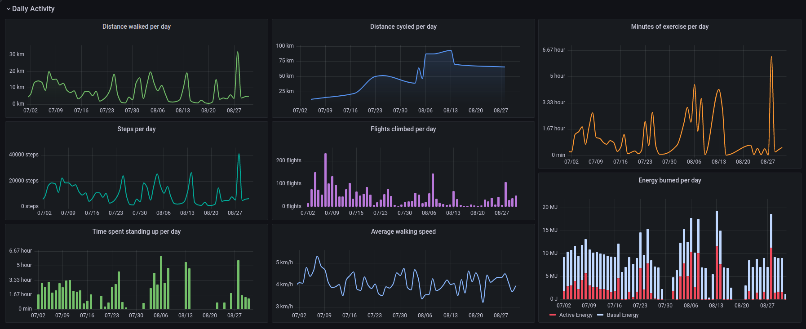

# apple health grafana

Tool to import your Apple health export data in Influx and visualize them in Grafana.



## Export your Apple health Data

From support.apple.com:
```
Share your health and fitness data in XML format

You can export all of your health and fitness data from Health in XML format, which is a common format for sharing data between apps.

    Tap your profile picture or initials at the top right.

    If you don’t see your profile picture or initials, tap Summary or Browse at the bottom of the screen, then scroll to the top of the screen.

    Tap Export all health data, then choose a method for sharing your data.
```

This will create a .zip file that can be shared from the iPhone.

Once you've copied/share the file to your computer, unzip it. You shoudl have a `export.xml` file in there. This is the file that contains all of your health data, and the one that will be parsed.

## Launching the stack

You'll need docker and docker-compose installed.

Clone the repo:

```sh
git clone https://github.com/k0rventen/apple-health-grafana.git
```

Change the following line in the `docker-compose.yml`:

```yaml
    volumes:
    - <local_export.xml_path>:/export.xml
```

by replacing the `<local_export.xml_path>` with your actual __export.xml__ file path, eg __/home/me/apple_health_export/export.xml__.

Then simply run `docker-compose up --build`. You should see some logs from influx & grafana, then some from the ingester container.
Wait for a log saying that all the data have been imported.

_Note: Depending on the amount of data the export has, it can take a few minutes to work through, and it may use a significant amount of resources._


## Visualization and next steps


Head to __http://localhost:3000__, and log with the grafana creds from the compose file (defaults to `admin`:`health`).

You should see some graphs with metrics in them.
2 dashboards are created by default, a more generic one displaying every metric available, and a more refined one for specific metrics.

## Tips on analyzing the data

Some metrics can be displayed __as is__, but others might need tweaking in the influx request:
- adjusting the time interval to 1d.
- using __sum()__ instead of __mean()__ to aggregate the metrics for a given interval
