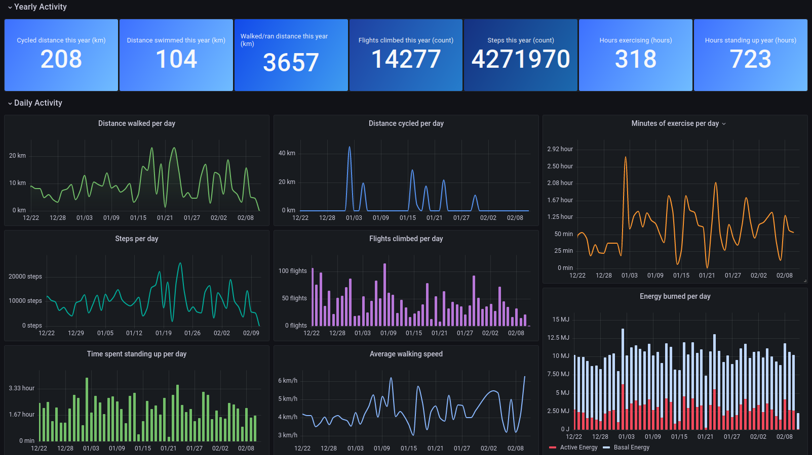
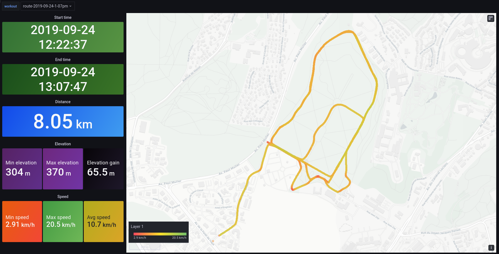
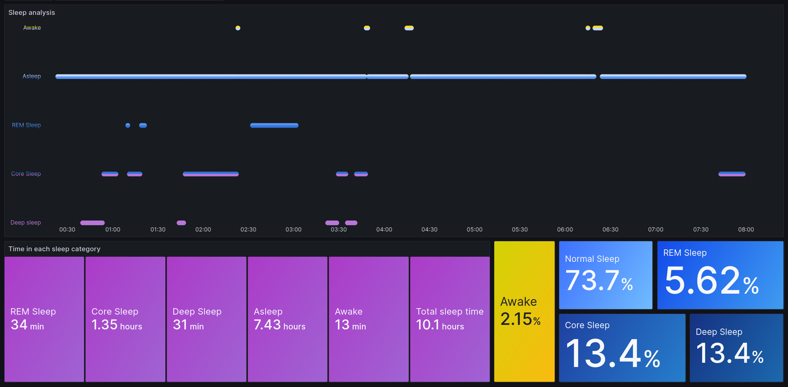

# Apple Health Grafana

Tool to import your Apple Health Data in Influx and visualize them in Grafana.

- ### Overall Fitness / Energy / Activity dashboard 
  
- ### Workout Routes:
  
- ### Sleep tracking:
  

## Export your Apple health Data

From [support.apple.com](https://support.apple.com/guide/iphone/share-your-health-data-iph5ede58c3d/ios):
```
Share your health and fitness data in XML format

You can export all of your health and fitness data from Health in XML format, which is a common format for sharing data between apps.

    Tap your profile picture or initials at the top right.

    If you don’t see your profile picture or initials, tap Summary or Browse at the bottom of the screen, then scroll to the top of the screen.

    Tap Export all health data, then choose a method for sharing your data.
```

This will create a .zip file that can be shared from the iPhone via Airdrop, messages, mail and so on.

_Note: If you encounter a 'Could not export data' message, increase the Auto-Lock timer of your iPhone (Settings>Display & Brightness) then try again._

Once you've copied/shared the file to your computer, note the path of the file (can be something like /home/me/downloads/export.zip)

## Launching the stack

You'll need docker and docker-compose installed.

Grab the compose file:

```sh
# wget
wget https://raw.githubusercontent.com/k0rventen/apple-health-grafana/main/docker-compose.yml

# curl
curl -sfLo docker-compose.yml https://raw.githubusercontent.com/k0rventen/apple-health-grafana/main/docker-compose.yml

# httpie
https --download https://raw.githubusercontent.com/k0rventen/apple-health-grafana/main/docker-compose.yml
```

Change the following line in the `docker-compose.yml`:

```yaml
    volumes:
    - <local_path_to_export.zip>:/export.zip
```

by replacing the `<local_path_to_export.zip>` with your actual health data export file path from the previous step, eg __/home/me/downloads/export.zip__:

```yaml
    volumes:
    - /home/me/downloads/export.zip:/export.zip
```

you can also use a relative path (assuming you are in the same directory as the compose file):
```yaml
    volumes:
    - ./export.zip:/export.zip
```


Then simply run :

```sh
# start grafana and influx in the background
docker-compose up -d grafana influx

# start our ingester
docker-compose up ingester
```


You should see some logs from the ingester container:
```
apple-health-grafana-ingester-1  | unzipping the export file..
apple-health-grafana-ingester-1  | export file unzipped
apple-health-grafana-ingester-1  | influx is ready
apple-health-grafana-ingester-1  | loading workout routes
apple-health-grafana-ingester-1  | opening Route 2022-01-16 4:19pm
...
apple-health-grafana-ingester-1  | inserted 1940000 records
apple-health-grafana-ingester-1  | Total number of records: 1942310
apple-health-grafana-ingester-1  | All done ! You can now check grafana.
apple-health-grafana-ingester-1 exited with code 0
```

Wait for a log saying that all the data have been imported.

_Note: Depending on the amount of data the export has, it can take a few minutes to work through. As an example, loading nearly 3 years of data (2 millions+ data points, 200+ workout routes) on a 10th gen i5 took 2 minutes and around 11 minutes on a Raspberry Pi 4._


## Visualization and next steps


Head to __http://localhost:3000__, and log in with the grafana creds from the compose file (defaults to `admin`:`health`).

You should see some graphs with metrics in them.
3 dashboards are created by default:
- a generic one displaying every metric available, 
- a more refined one for specific metrics that are probably present , like walking distance, hearth related metrics..
- a workout routes one, that shows a GPS map of your outdoor routes (walking/running/biking).
- a sleep tracking dashboard, that displays how much time/percentage is spent in each sleep category.

## Tips on further analyzing the data

Some metrics can be displayed __as is__, but others might need tweaking in the influx request:
- adjusting the time interval to 1d to group daily metrics.
- using __sum()__ instead of __mean()__ to aggregate the metrics for a given interval.
